# Bank Loan Case Study (Using Excel)
 The project focuses on analysing the likelihood of loan default

# Project Description
The analysis aims to uncover patterns within a dataset containing information about loan applications, focusing on identifying factors influencing the likelihood of loan default. The dataset encompasses two distinct scenarios: when customers apply for loans and face either payment difficulties or all other cases.
In the former scenario, customers experienced late payments exceeding a certain threshold on initial instalments, while the latter encompasses cases where payments were made on time.
The project's primary objective is to employ Exploratory Data Analysis (EDA) techniques to discern how customer attributes and loan characteristics contribute to the probability of default. By understanding these patterns, the company can make informed decisions regarding loan approval, such as adjusting loan amounts, interest rates, or denying loans to high-risk applicants.
Key Business Objectives:
-	Identify predictive factors indicating whether a customer is likely to encounter difficulties in repaying their loan instalments.
-	Improve decision-making processes related to loan approval by leveraging insights gleaned from EDA.
-	Mitigate financial risk by proactively identifying high-risk loan applicants and implementing appropriate measures, such as adjusting loan terms or denying loans altogether.

# Approach
Upon reviewing the dataset description, the files were downloaded, including:
1.	Application Data: The primary dataset containing comprehensive information about current loan applicants.
2.	Previous Application Data: Historical data on past loan applicants.
3.	Column Description: Detailed descriptions of each feature present in the dataset, aiding in understanding the data attributes.
4.	Important Notes for Project 6: Providing insights and instructions pertinent to the project.
Following the download, each file was meticulously examined to grasp its contents and relevance to the project objectives. Here's a breakdown of the approach:
•	Application Data: Focused on extracting insights related to current loan applicants.
•	Previous Application Data: Analysis of past applicant behavior and trends.
•	Column Description: Understanding the nuances of each feature to facilitate a deeper understanding of the dataset's attributes.
•	Important Notes for Project 6: Utilized for crucial information and guidelines essential for executing the project effectively.
Additionally, supplementary research was conducted through relevant articles and resources on risk analysis, ensuring a comprehensive grasp of the project's objectives and methodologies. This preparatory phase equipped with the necessary insights to embark on the subsequent stages of data exploration and analysis effectively.

# Tech Stack Used
Microsoft Excel 2021 version is used for this project due to its simplicity of use 
and extraordinary analysis and visualization capability.

# Tasks 
## A. Identify Missing Data and Deal with it Appropriately: 

-	In the application data file, several columns had null (NaN) values. Here are the new columns I introduced from the existing ones:
1.	Average EXT_SOURCE: Created from EXT_SOURCE_1, EXT_SOURCE_2, and EXT_SOURCE_3. As these columns contained float scores, but with varying percentages of null data (56.35%, 0.25%, and 19.89% respectively), I computed their average to utilize all available data effectively.
2.	Total FLAG_DOCUMENT: Consolidated from FLAG_DOCUMENT_2 to FLAG_DOCUMENT_21. While these columns had no null values, their unspecified document references prompted total aggregation, facilitating easy analysis of document submission patterns.
3.	Years Birth: Derived from DAYS_BIRTH, converting days to years.
4.	Years Employed: Derived from DAYS_EMPLOYED, converting days to years.
5.	Years Registration: Derived from DAYS_REGISTRATION, converting days to years.
6.	Years ID_PUBLISH: Derived from DAYS_ID_PUBLISH, converting days to years.

-	Columns dropped due to insufficient data (with null values > 30%):

- A graph depicting Null values in Raw Dataset

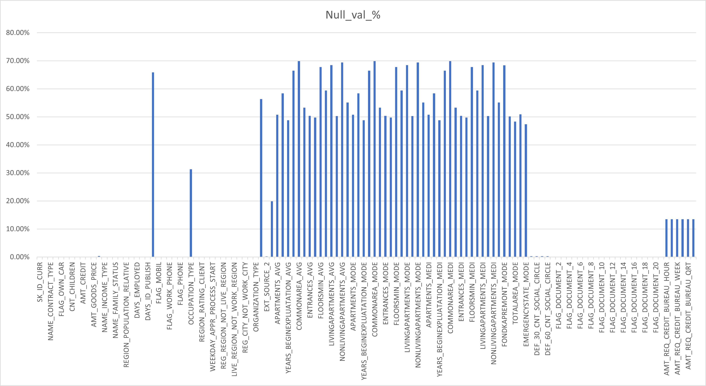

## B. Identify Outliers in the Dataset:

To identify outliers within the dataset, I employed the interquartile range (IQR) method, which involves computing the first quartile (Q1) and the third quartile (Q3) at the 25th and 75th percentiles, respectively. I then utilized a multiplier value (k) of 1.5 to establish thresholds for the lower and upper limits.
Upon examination of the column AMT_INCOME_TOTAL, an outlier was detected with a value of 117,000,000. This value stands out significantly from the rest of the dataset, as illustrated in the scatterplot graph that depicts the data both with and without the outlier [3825000, 3600000, 117000000]

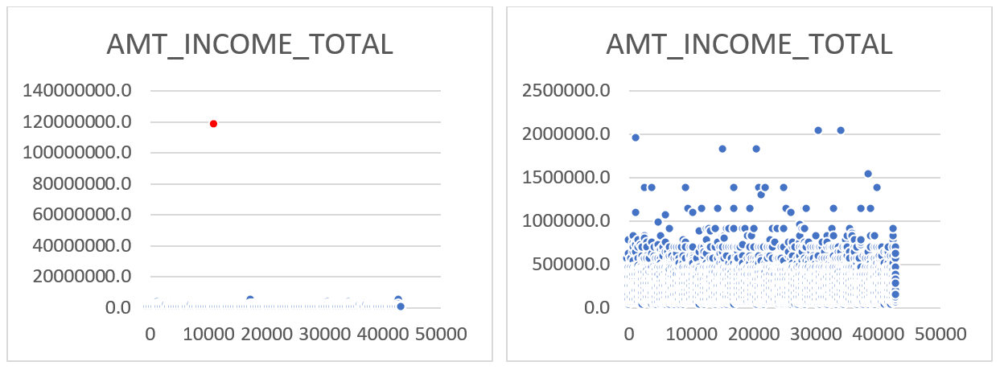

Similarly, in the column YEARS_EMPLOYED, outliers were observed, suggesting potential typographical errors. Notably, one entry indicates an applicant's employment duration of 1001 years, which is clearly implausible. This anomaly is evident in the accompanying graph.

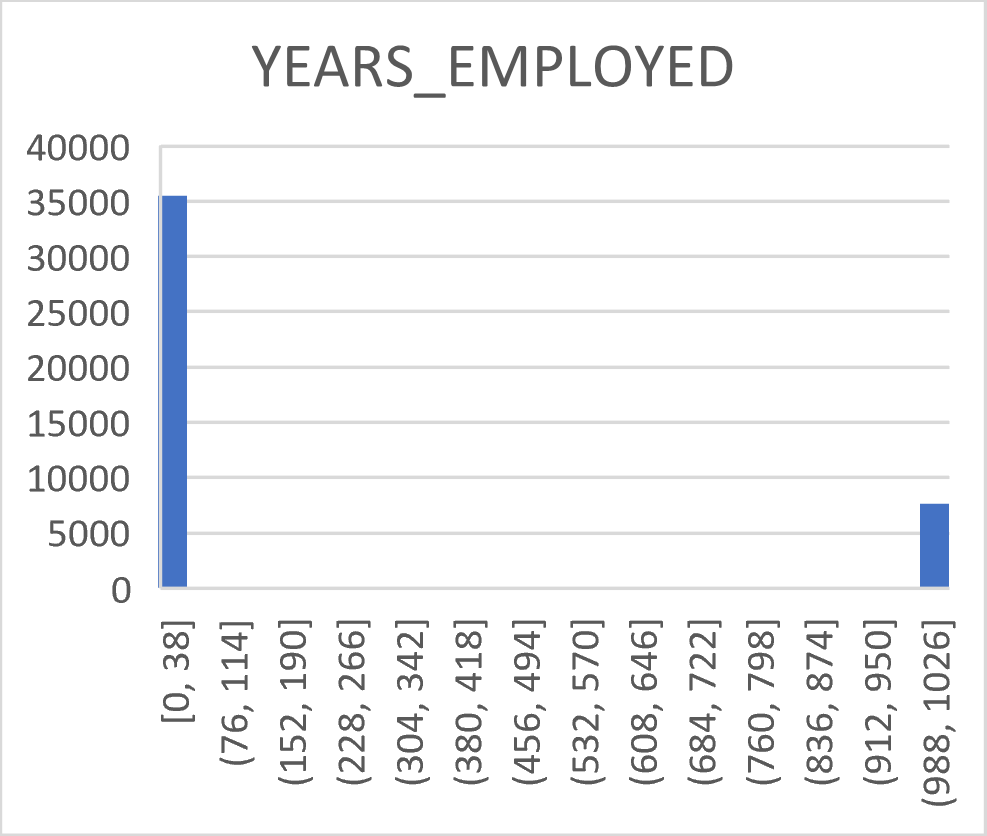

For further insight, scatterplot graphs were generated for columns such as AMT_CREDIT, AMT_ANNUITY, AMT_GOODS_PRICE, and YEARS_REGISTRATION. These visualizations aid in identifying any additional outliers and understanding their impact on the dataset's distribution and overall analysis.

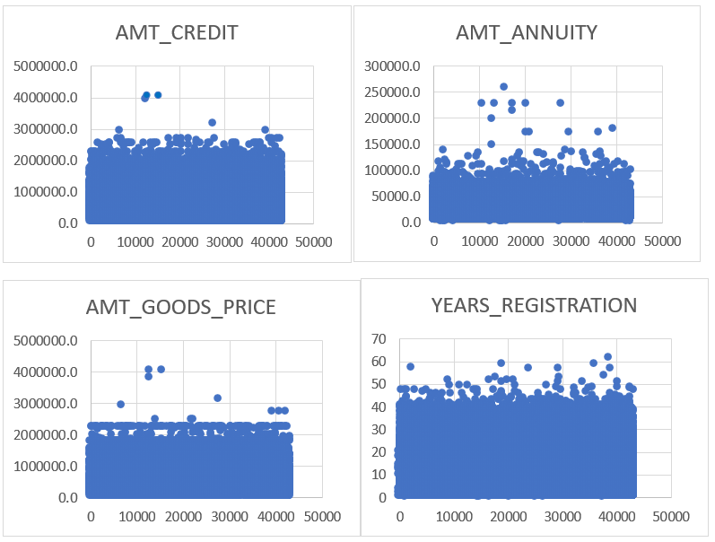

## C. Analyze Data Imbalance: 

The dataset reveals a notable imbalance in certain columns, with some features displaying varying degrees of disproportion between different categories. Here's an examination of the data imbalance across three categories:
1.	Mild Imbalance [20-40% minority proportion]:
•	CODE_GENDER: 34.03% Male against 65.97% Female
•	FLAG_OWN_CAR: 34.87% "N" Value against 65.13% "Y" Value
•	FLAG_OWN_REALTY: 31% "N" value against 69% "Y" value
•	FLAG_PHONE: 28.10% "1" value against 71.90% "0" value
•	REG_CITY_NOT_WORK_CITY: 22.79% "1" value against 77.21% "0" value

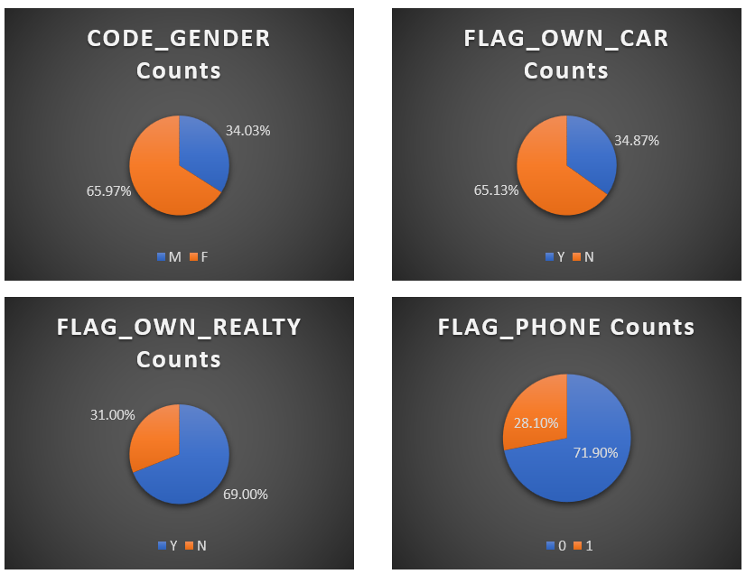

2.	Moderate Imbalance [1-20% minority proportion]:
•	FLAG_EMAIL: 5.67% "1" value against 94.33% "0" value
•	FLAG_EMP_PHONE: 17.67% "1" value against 82.33% "0" value
•	FLAG_WORK_PHONE: 19.81% "1" value against 80.19% "0" value
•	REG_REGION_NOT_WORK_REGION: 4.89% "1" value against 95.11% "0" value
•	LIVE_CITY_NOT_WORK_CITY: 17.78% "1" value against 82.22% "0" value

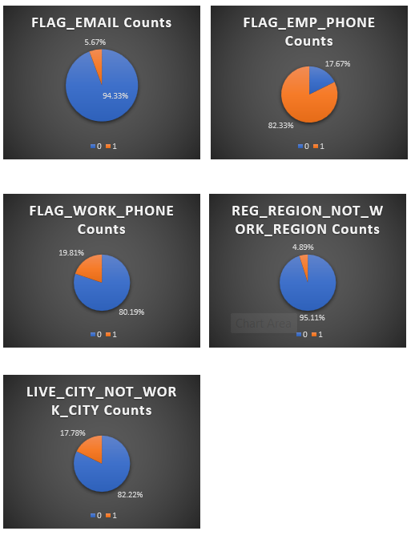

3.	Extreme Imbalance [less than 1% minority proportion]:
•	FLAG_CONT_MOBILE: 0.21% "0" value against 99.79% "1" value

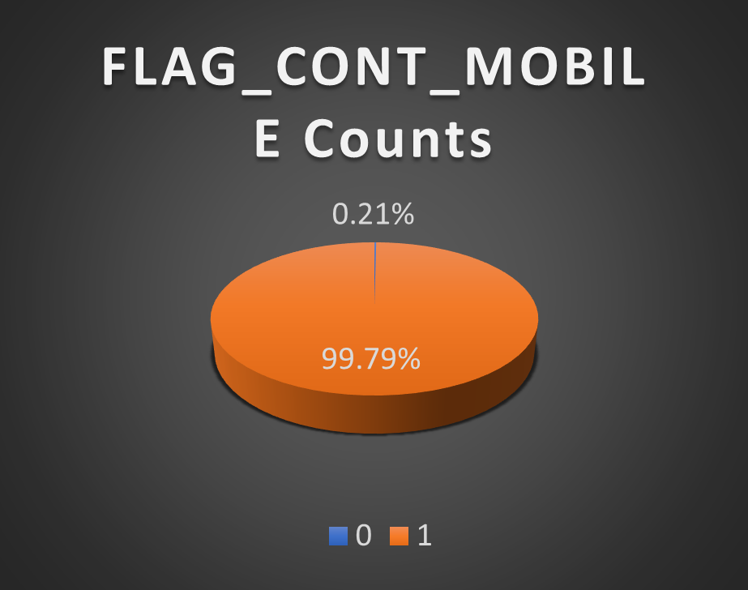

## D. Perform Univariate, Segmented Univariate, and Bivariate Analysis

To conduct the analysis effectively, several key columns were selected, including AMT_INCOME_TOTAL, AMT_CREDIT, AMT_ANNUITY, AMT_GOODS_PRICE, Avg_EXT_SOURCE, and YEARS_EMPLOYED.
Next, the values in these columns were categorized into bins using nested IF and AND functions, resulting in the creation of six new columns representing the bin values.
Subsequently, pivot tables were generated from these columns to perform univariate analysis, comparing each of the six columns with the Target value of 1. This allowed for an understanding of how each column correlates with loan default. (i've kept one observation for example, please refer to either PDF or Excel file attached to find more)

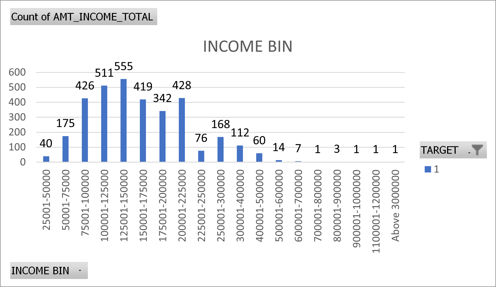

Following the univariate analysis, segmented univariate analysis was conducted, enabling both Target 0 and 1 against each of the six columns individually. This segmentation provided insights into how different values within each column impact loan default rates.

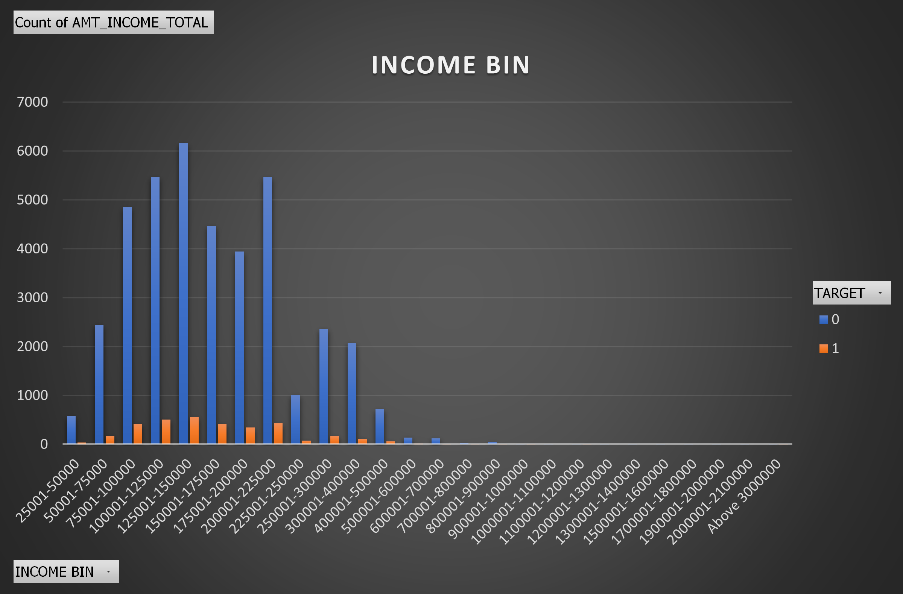

Finally, bivariate analysis was conducted by examining relationships between certain column pairs. For instance, the relationship between income bin and average credit amount, credit bin and average annuity, and credit bin and average goods price amount were analyzed.

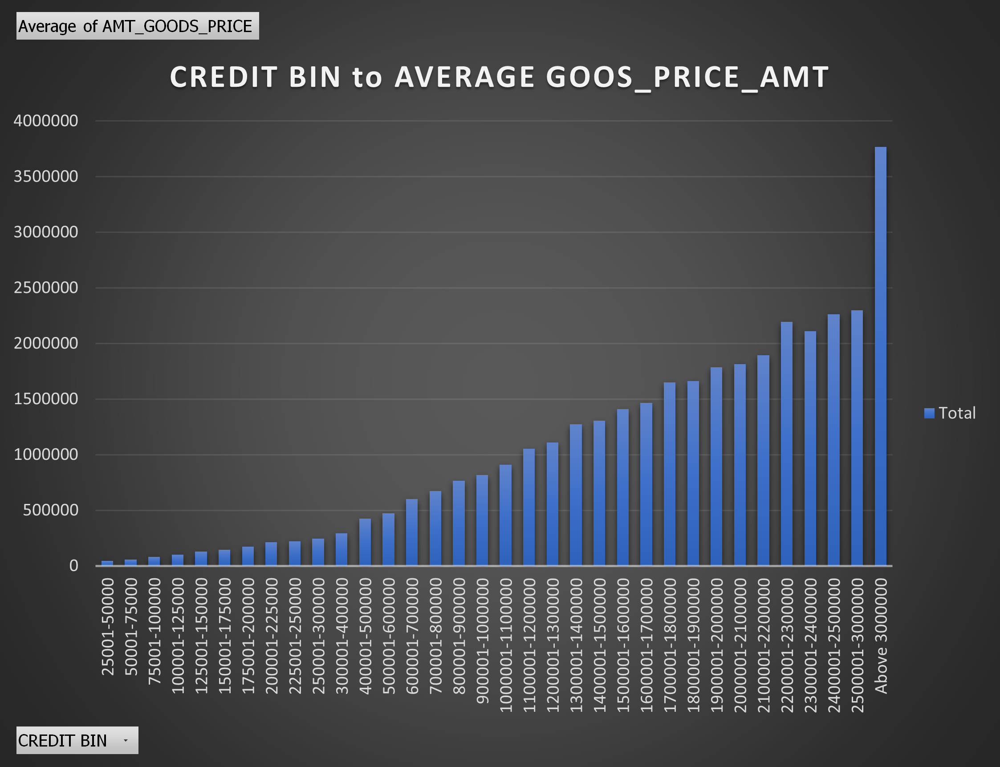

## E. Identify Top Correlations for Different Scenarios: 
Top correlations were identified through three iterations of analysis:
1.	All Applicants:
-	Avg_EXT_SOURCE: -0.226
-	YEARS_BIRTH: -0.080
-	REGION_RATING_CLIENT_W_CITY: 0.065
-	REGION_RATING_CLIENT: 0.064
-	DAYS_LAST_PHONE_CHANGE: 0.054

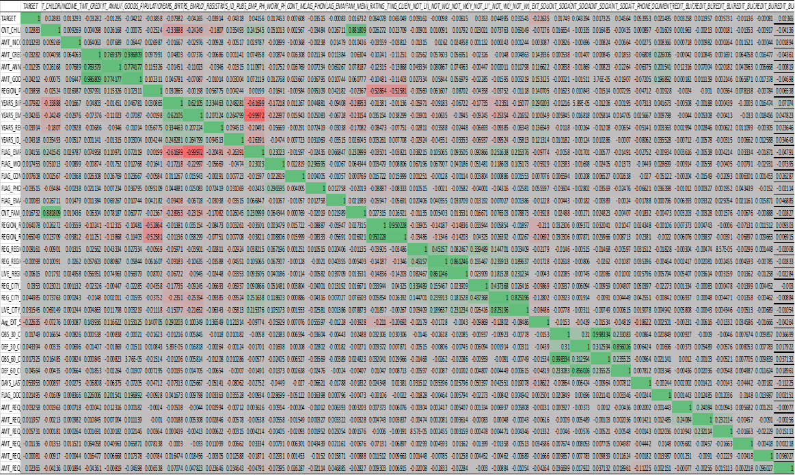

2.	Applicants with Payment Difficulties:
-	FLAG_EMP_PHONE vs. YEARS_EMPLOYED: -0.999
-	OBS_60_CNT_SOCIAL_CIRCLE vs. OBS_30_CNT_SOCIAL_CIRCLE: 0.998
-	AMT_GOODS_PRICE vs. AMT_CREDIT: 0.982
-	REGION_RATING_CLIENT_W_CITY vs. REGION_RATING_CLIENT: 0.949
-	FLAG_EMP_PHONE vs. YEARS_BIRTH: -0.586

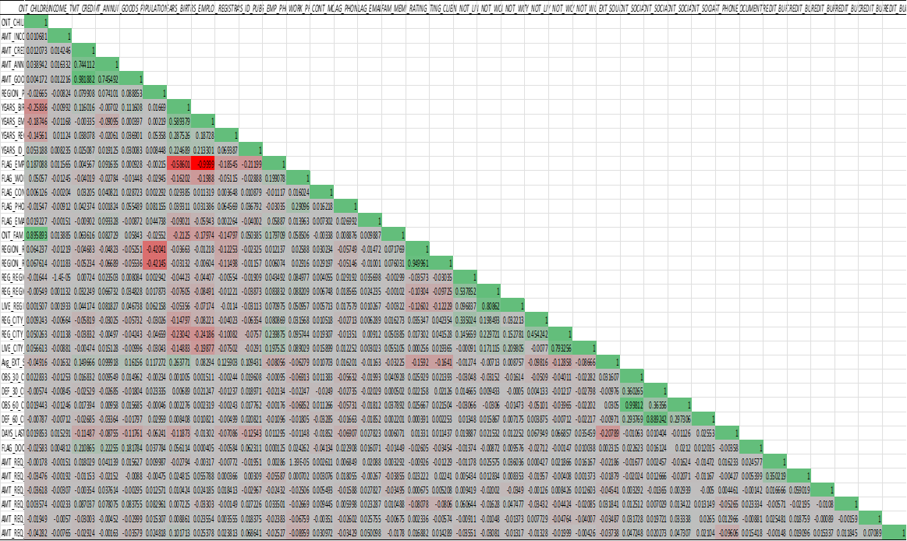

3.	All Other Cases:
-	FLAG_EMP_PHONE vs. YEARS_EMPLOYED: -0.999
-	OBS_60_CNT_SOCIAL_CIRCLE vs. OBS_30_CNT_SOCIAL_CIRCLE: 0.998
-	AMT_GOODS_PRICE vs. AMT_CREDIT: 0.982
-	REGION_RATING_CLIENT_W_CITY vs. REGION_RATING_CLIENT: 0.949
-	FLAG_EMP_PHONE vs. YEARS_BIRTH: -0.586

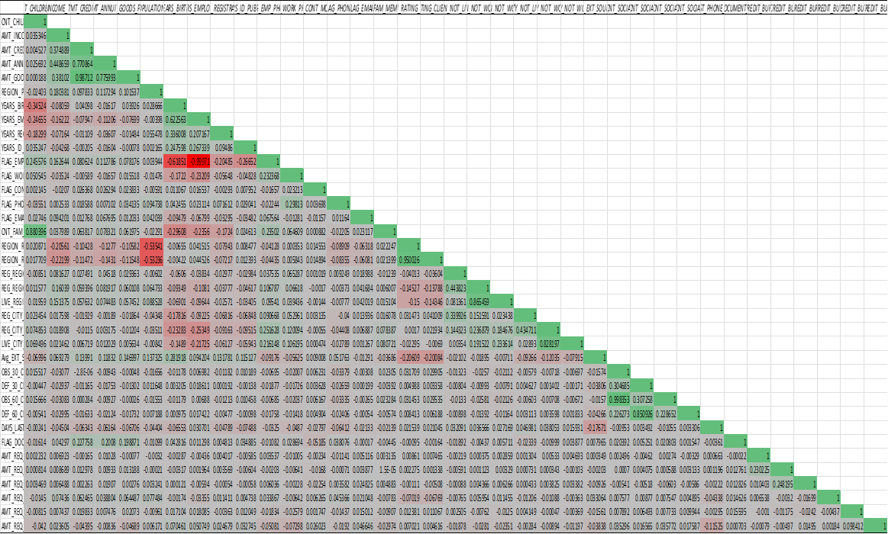

# Insights

- Within the application data file, a significant majority of applications, accounting for 90.68%, were registered for cash loans, whereas 9.32% of applications were earmarked for revolving loans. This distribution underscores the prevalent preference for cash loans among applicants.
- The Average External Sources (Avg EXT Sources) emerged as a pivotal feature in assessing loan defaults. Introducing additional features akin to Avg EXT Sources could enhance the model's robustness, enabling a more comprehensive analysis of loan repayment probabilities.
- An intriguing insight from the dataset's 'Name Income Type' column indicates that 17.66% of applicants identify as pensioners. This demographic segment represents a substantial portion of the applicant pool, warranting targeted strategies tailored to their unique financial circumstances.
- In loan borrower analysis, the region rating assumes paramount importance. Regions with lower ratings often face heightened scrutiny during the loan approval process, potentially leading to application rejections. Juxtaposing region rating with metrics like OBS_30_CNT_SOCIAL_CIRCLE and OBS_60_CNT_SOCIAL_CIRCLE could yield valuable insights. Such an approach could help identify applicants associated with groups of defaulters, thereby safeguarding against potential exploitation of financial institution resources.
- An intriguing observation stems from the 'DAYS_LAST_PHONE_CHANGE' column in the dataset. Among defaulted applications, a noteworthy 14.79% of individuals altered their phone numbers on the same day as their application, as indicated by the unique value '0' in this column. This finding suggests a potential correlation between immediate phone number changes and loan default, warranting further investigation into the underlying causes.
